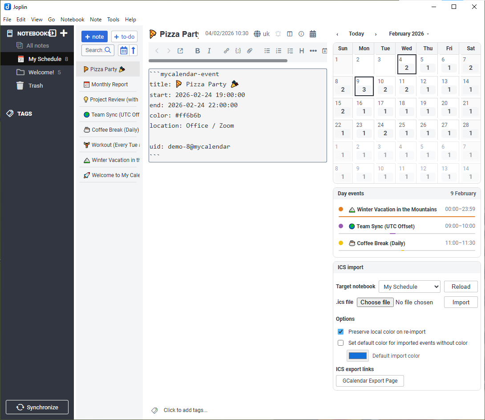
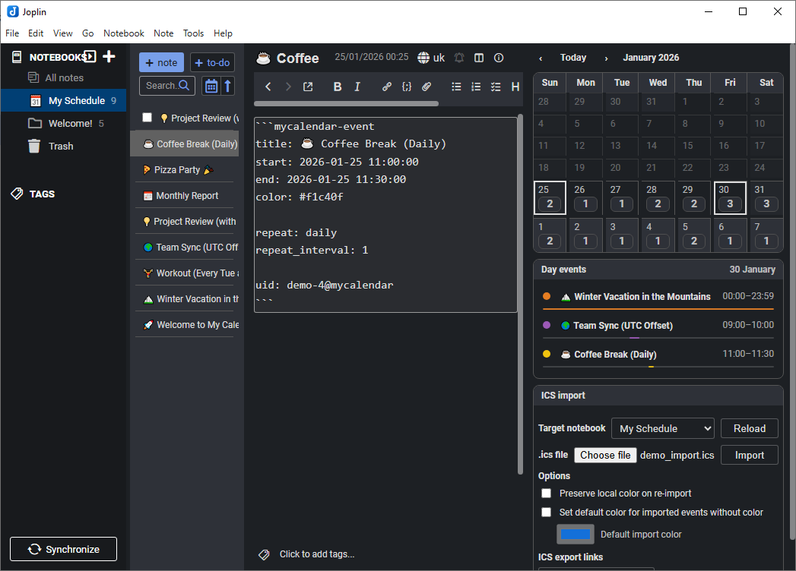
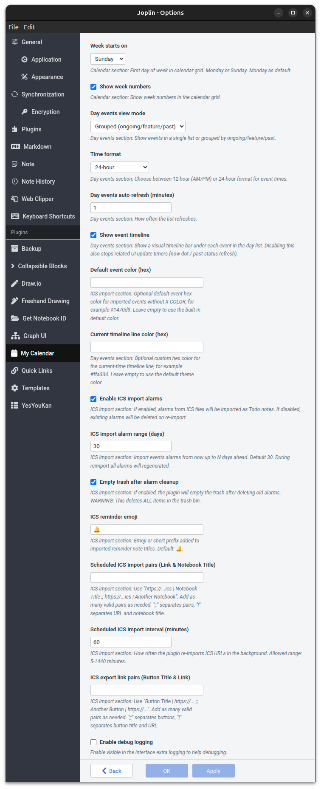

# 🗓️ My Calendar for Joplin

[](https://joplinapp.org/)
[](https://www.typescriptlang.org/)
[](https://opensource.org/licenses/MIT)
[](https://www.paypal.me/volodymyroliinykca)

**My Calendar** is a powerful, flexible, and privacy-focused calendar plugin for [Joplin](https://joplinapp.org/). It
turns your notes into calendar events, providing a unified view of your schedule directly within your favorite
note-taking app.

|                     Light Mode                     |                    Dark Mode                     |
|:--------------------------------------------------:|:------------------------------------------------:|
|  |  |

---

## 🌟 Key Features

- **Integrated Monthly Calendar**:
    - **Visual Grid**: View your schedule with event bars and alarm indicators.
    - **Navigation**: Quick jump to any date via the month/year picker.
    - **Customization**: Toggle week numbers and choose Monday or Sunday start.
- **Smart Day View**:
    - **Detailed Timeline**: See a chronological list of the day's events with a current time indicator.
    - **Interactive**: Click events to open the corresponding note.
- **Notes as Events**:
    - **Simple Syntax**: Turn any note into an event by adding a metadata block.
    - **Rich Details**: Support for timezones, locations, custom colors, and recurrence.
- **Robust ICS Import**:
    - **Broad Compatibility**: Import `.ics` files from Google Calendar, Outlook, Apple, etc.
    - **Recurrence**: Full support for complex recurring event patterns.
    - **Smart Sync**: Deduplicates events and preserves local changes like custom colors.
- **Native Alarms**:
    - **System Notifications**: Automatically converts calendar alarms into Joplin "Todo" notes, triggering native
      reminders on Desktop and Mobile.
- **Security & Privacy**:
    - **Sanitized**: Protection against malicious Markdown/CSS.
    - **Local**: Works with Joplin's existing sync; no external servers required.

### 📱 Platform Availability

While we strive for parity, some features are specific to the Desktop version due to platform-specific APIs.

| Feature                            | Desktop | Mobile |
|:-----------------------------------|:-------:|:------:|
| Monthly Calendar Grid              |    ✅    |   ✅    |
| Smart Day View                     |    ✅    |   ✅    |
| Native Joplin Settings             |    ✅    |   ✅    |
| ICS File Import                    |    ✅    |   ❌    |
| Quick ICS Export Links             |    ✅    |   ❌    |
| Markdown Sanitization              |    ✅    |   ✅    |
| Automatic Alarms (Todo generation) |    ✅    |   ✅*   |

*\*Note: Alarms are generated/synced during the import process on Desktop. Once created as "Todo" notes, they will sync
and trigger notifications on Mobile automatically.*

---

## 🚀 Getting Started

### 1. Installation

1. Open **Joplin Desktop**.
2. Go to `Tools` > `Options` (Windows/Linux) or `Joplin` > `Settings` (macOS).
3. Select `Plugins` and search for `My Calendar`.
4. Click **Install** and restart Joplin.

### 2. Manual Event Creation

You don't need to import files to use the calendar. Simply add the following block to any note:

~~~markdown
```mycalendar-event
title: Meeting with Team
start: 2026-02-04 10:00+02:00
end: 2026-02-04 11:30+02:00
color: #3498db
location: Conference Room B
```
~~~

The note will immediately appear on your calendar!

> 💡 **Looking for more?** Check the [examples](./examples) folder for more templates, including recurring events and
> all-day appointments.

---

## 📥 ICS Import System

The plugin features a robust import system designed for performance and reliability.

### How to Import:

1. Open the **My Calendar** panel.
2. Select the **Target Notebook** where you want your events to be stored.
3. Choose your `*.ics` file and click **Import**.

### Smart Features:

- **Deduplication**: The plugin uses `UID`s from the ICS file. If you import the same file again, it will only update
  changed events or skip unchanged ones.
- **Local Color Preservation**: By default, if you manually change the color of an imported event in Joplin, subsequent
  imports will preserve your custom color.
- **Optimized Automatic Alarms**: If an ICS event has a reminder, the plugin creates a linked "Todo" note in Joplin.
  These todos
  appear in your standard Joplin tasks and trigger native notifications. The sync process is smart: it only deletes
  outdated alarms and creates new ones, minimizing sync traffic.

---

## 🛠️ Advanced Syntax

Below is the full list of properties supported inside the ` ```mycalendar-event ` block:

| Property          | Status       | Description                                                                          | Example                  |
|:------------------|:-------------|:-------------------------------------------------------------------------------------|:-------------------------|
| `start`           | **Required** | Start date and time. Mandatory for the event to appear.                              | `2025-12-18 10:00+02:00` |
| `title`           | Optional     | Display name. If omitted, the **Joplin note title** will be used.                    | `Meeting`                |
| `end`             | Optional     | End date and time. If omitted, the event is treated as a point in time (0 duration). | `2025-12-18 11:30+02:00` |
| `tz`              | Optional     | Timezone (IANA).                                                                     | `America/Toronto`        |
| `color`           | Optional     | Hex color for the event bar.                                                         | `#e74c3c`                |
| `location`        | Optional     | Location string.                                                                     | `Home Office`            |
| `description`     | Optional     | Extra details (auto-sanitized).                                                      | `Check project status.`  |
| `repeat`          | Optional     | `daily`, `weekly`, `monthly`, `yearly`                                               | `weekly`                 |
| `repeat_interval` | Optional     | Frequency (e.g., every 2 weeks).                                                     | `2`                      |
| `repeat_until`    | Optional     | End date for recurrence (e.g., wrap up series).                                      | `2026-12-31`             |
| `byweekday`       | Optional     | Specific days for weekly repeat.                                                     | `MO,WE,FR`               |
| `bymonthday`      | Optional     | Day of the month for monthly repeat.                                                 | `15`                     |
| `all_day`         | Optional     | Set to `true` for all-day events.                                                    | `true`                   |

### 🕒 Supported Time & Timezone Formats

The calendar supports several ways to specify the time and timezone of your events:

1. **With UTC Offset (Recommended)**
   Explicitly define the time and its relation to UTC. This time will be automatically converted to your current
   device's timezone.
   ```text
   start: 2026-02-04 10:00+02:00
   ```

2. **With `tz` Property (IANA)**
   Specify the time and the exact IANA Timezone name. The plugin will handle the conversion based on daylight saving
   rules.
   ```text
   start: 2026-02-04 10:00
   tz: America/Toronto
   ```

3. **Floating Local Time**
   If no offset or `tz` is provided, the time is considered "floating" and will be shown exactly as written, regardless
   of the device's timezone settings.
   ```text
   start: 2026-02-04 10:00
   ```

---

## ⚙️ Settings

Customize your experience in the Joplin Settings (`Tools` > `Options` > `My Calendar`):

### Calendar

- **Week starts on**: Choose between **Monday** (default) or **Sunday** for the calendar grid.
- **Show week numbers**: Toggle the display of week numbers alongside the calendar grid. (Default: Disabled).

### Day events

- **Day events view mode**: Show events as one list, or grouped into **Ongoing / Feature / Past** with auto-moves as
  time changes. (Default: Single list).
- **Time format**: Choose between **24h** (default) or **12h** (AM/PM) format for event times.
- **Day events auto-refresh**: Set the interval (in minutes) for how often the day's event list updates. (Default: 1
  min).
- **Show event timeline**: Show a visual timeline bar under each event in the day list. Disabling this also stops
  related UI update timers. (Default: Enabled).

### ICS Import (Desktop only)

- **Enable ICS import alarms**: If enabled, alarms from ICS files will be imported as Todo notes. If disabled, existing
  alarms will be deleted on re-import. (Default: Disabled).
- **ICS import alarm range**: Define how many days into the future (up to 365) the plugin should scan and generate
  native Joplin reminders from your ICS files. (Default: 30 days).
- **Empty trash after alarm cleanup**: If enabled, the plugin will empty the trash after deleting old alarms. **WARNING
  **:
  This deletes ALL items in the trash. (Default: Disabled).
- **ICS export links**: Add up to 4 quick-access links to your favorite calendar exporters (e.g., Google
  Calendar Export URL). These will appear as convenient buttons in the import panel.

### Developer

- **Enable debug logging**: Activates a visible log box and extra console output to help troubleshoot any issues.

#### Settings Interface

|                           Light Theme                           |                          Dark Theme                           |
|:---------------------------------------------------------------:|:-------------------------------------------------------------:|
|  |  |

---

## 👨‍💻 Development

### Commands

- `npm run build`: Compile the project.
- `npm pack`: Create the `.jpl` distribution file.
- `npm test`: Run the extensive test suite (350+ cases).
- `npm run lint`: Check code style and common patterns.
- `pkill -f jest || true;pkill -f node || true;rm -rf node_modules/.cache;rm -rf ~/.cache/jest;npx jest --clearCache`:
  Cache cleaning.

### Automation Scripts

The project includes helper scripts in the `scripts/` directory to streamline development and release processes.

#### `scripts/pre-pack.sh`

Ensures code quality before packaging. It runs the linter (failing on warnings) and the full test suite.

```bash
bash ./scripts/pre-pack.sh;
```

#### `scripts/release.sh`

Automates the entire release workflow: bumps version, syncs manifest, tags, pushes, and publishes to NPM.

```bash
bash ./scripts/release.sh [patch|minor|major];
```

#### `scripts/update-demo-ics.py`

Automatically shifts dates in the demo ICS file to start from today. Useful for refreshing screenshots.

```bash
./scripts/update-demo-ics.py;
```

#### `scripts/check-tests.sh`

Verifies that tests have passed recently (within the last hour) before allowing critical operations.

```bash
bash ./scripts/check-tests.sh;
```

#### `scripts/preview-changelog.sh`

Previews the changelog generation in dry-run mode without modifying files.

```bash
bash ./scripts/preview-changelog.sh [patch|minor|major];
```

### Development Workflow

For a detailed guide on branch naming, commit message formats, and the release process, please see the *
*[Development Workflow Guide](./docs/WORKFLOW.md)**.

### Security First:

The code implements strict sanitization to ensure that imported calendar data cannot execute arbitrary Markdown or break
the Joplin interface.

## ❤️ Support

If you find this plugin useful, please consider supporting its development. Your donations help me dedicate more time to
maintaining the project and adding new features.

- **[Donate via PayPal](https://www.paypal.me/volodymyroliinykca)** - support the development of **My Calendar**.

Every coffee counts. Thank you! ☕

---

## 📜 Changelog

Detailed changes for each release are documented in the [CHANGELOG](./CHANGELOG.md).

## 📄 License

Copyright (c) 2024-2026 Volodymyr Oliinyk.
Licensed under the **MIT License**. See the [LICENSE](LICENSE) file for details.
