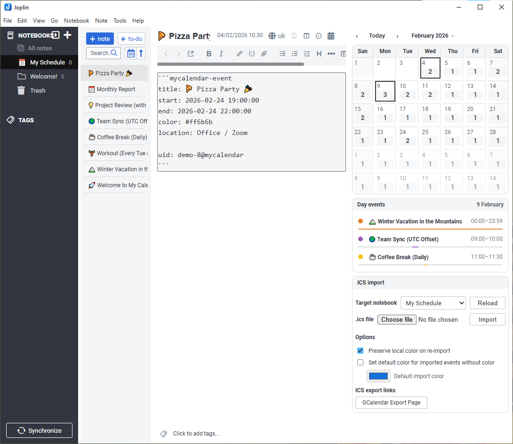
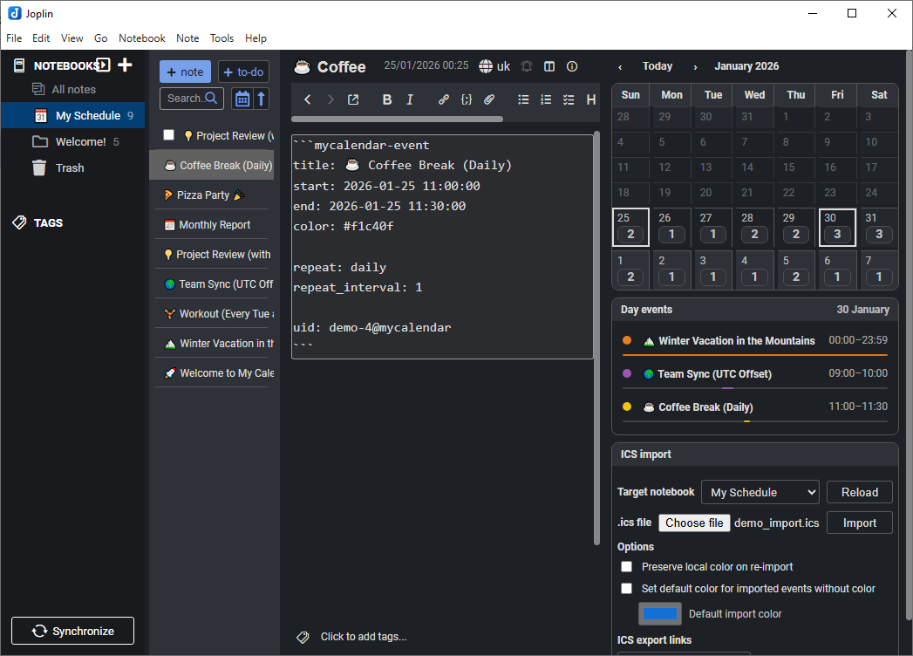
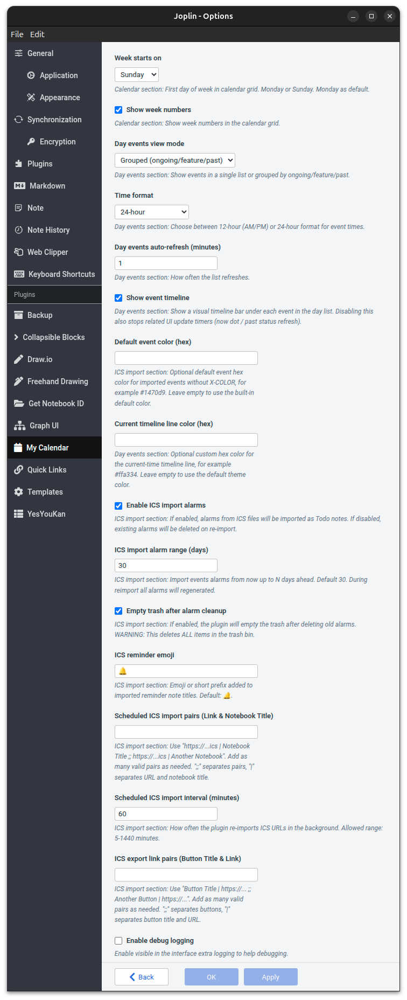
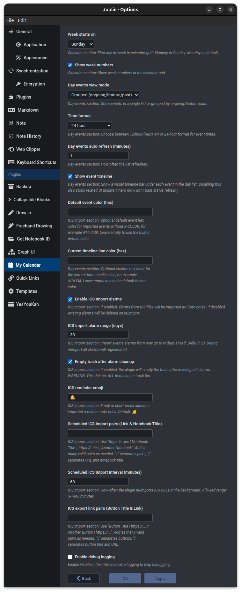

# 🗓️ My Calendar for Joplin

[](https://joplinapp.org/)
[](https://www.typescriptlang.org/)
[](https://opensource.org/licenses/MIT)
[](https://www.paypal.me/volodymyroliinykca)

My Calendar adds a calendar panel to Joplin. Events are stored as regular Joplin notes, so they stay with your notes and
use your normal Joplin sync.

|                     Light mode                     |                    Dark mode                     |
|:--------------------------------------------------:|:------------------------------------------------:|
|  |  |

## Features

- Month calendar with colored events, alarm markers, quick month and year selection, week numbers, and Monday or Sunday
  as the first day of the week.
- Day list with current, future, and past events. Completed Joplin Todo events are dimmed and marked with a check.
- Event timeline and 12-hour or 24-hour time display.
- Click an event to open its Joplin note.
- Create events from a form in the calendar panel, with field checks and searchable Joplin tags.
- Create events by adding a `mycalendar-event` block to any note.
- Store more than one event in the same note.
- Daily, weekly, monthly, and yearly repeats.
- All-day events, timezones, locations, descriptions, colors, and excluded repeat dates.
- Manual ICS file import on desktop.
- Scheduled ICS import from HTTPS links on desktop.
- Optional Joplin Todo reminders from ICS alarms.
- Toolbar buttons to clear the event cache and run scheduled imports now.
- Light and dark theme support.
- Desktop and mobile support for the calendar and event form.

### Platform support

| Feature                               | Desktop | Mobile |
|:--------------------------------------|:-------:|:------:|
| Calendar and day list                 |   ✅    |   ✅   |
| Create events                         |   ✅    |   ✅   |
| Plugin settings                       |   ✅    |   ✅   |
| Manual ICS file import                |   ✅    |   ❌   |
| Scheduled ICS import from HTTPS URLs  |   ✅    |   ❌   |
| External ICS export links             |   ✅    |   ❌   |
| Create Todo reminders from ICS alarms |   ✅    |   ❌   |

Reminder notes created on desktop can sync to mobile and use Joplin's normal mobile notifications.

## Install

My Calendar requires Joplin 3.3 or later.

1. Open Joplin.
2. Go to **Tools > Options > Plugins** on Windows/Linux or **Joplin > Settings > Plugins** on macOS.
3. Search for **My Calendar**.
4. Select **Install**, then restart Joplin.

On desktop, use **Toggle My Calendar** from the View or Tools menu to show or hide the panel. The default shortcut is
`Ctrl+Alt+C`. On mobile, open the plugin from Joplin's plugin menu.

## Create an event

### Use the form

1. Open the **My Calendar** panel.
2. Find **Add event note**.
3. Choose a notebook.
4. Enter the event details.
5. Select **Create**.

The plugin creates a Joplin note, adds the selected tags, opens the note, and refreshes the calendar.

The form supports timed and all-day events, timezones, colors, locations, descriptions, searchable tags, repeats, repeat
end dates, weekdays, month days, and excluded dates. It highlights invalid fields before creating the note.

### Add an event block to a note

Add a fenced block like this to any note:

~~~markdown
```mycalendar-event
title: Meeting with Team
start: 2026-02-04 10:00+02:00
end: 2026-02-04 11:30+02:00
color: #3498db
location: Conference Room B
```
~~~

Only `start` is required. If `title` is missing, the note title is used.

You can keep normal text before and after the block. You can also add several event blocks to one note. See the
[examples](./examples) folder for all-day, recurring, timezone, and multi-event notes.

## Event fields

| Field             | What it does                                      | Example                   |
|:------------------|:--------------------------------------------------|:--------------------------|
| `start`           | Event start. Required.                            | `2026-02-04 10:00+02:00`  |
| `end`             | Event end.                                        | `2026-02-04 11:30+02:00`  |
| `title`           | Event name. Uses the note title when empty.       | `Team meeting`            |
| `description`     | Extra text shown in the day list.                 | `Review the current work` |
| `location`        | Event location.                                   | `Conference Room B`       |
| `color`           | Event color in `#RGB` or `#RRGGBB` form.          | `#3498db`                 |
| `tz`              | IANA timezone for a time without an offset.       | `America/Toronto`         |
| `all_day`         | Marks an event as all-day.                        | `true`                    |
| `repeat`          | Repeat rule: daily, weekly, monthly, or yearly.   | `weekly`                  |
| `repeat_interval` | Repeat every N days, weeks, months, or years.     | `2`                       |
| `repeat_until`    | Last date or time in the repeat series.           | `2026-12-31`              |
| `byweekday`       | Days for a weekly repeat.                         | `MO,WE,FR`                |
| `bymonthday`      | Day of the month for a monthly repeat.            | `15`                      |
| `exdate`          | Excludes one date from a repeat. Can be repeated. | `2026-03-04`              |
| `valarm`          | Alarm data imported from ICS.                     | `{"trigger":"-PT15M"}`    |
| `uid`             | Stable source ID. Usually managed by the plugin.  | `event-123`               |
| `recurrence_id`   | ID of one changed repeat occurrence.              | `20260304T100000Z`        |

`uid`, `recurrence_id`, and `valarm` are mainly used by ICS import. You normally do not need to add them by hand.

### Dates and timezones

Use one of these forms:

```text
start: 2026-02-04 10:00+02:00
```

The UTC offset makes the time clear on every device.

```text
start: 2026-02-04 10:00
tz: America/Toronto
```

The IANA timezone applies the correct daylight-saving rules.

```text
start: 2026-02-04 10:00
```

Without an offset or `tz`, the value is a local floating time and is shown as written.

## Import ICS calendars

ICS import is available on desktop.

1. Open the **My Calendar** panel.
2. In **ICS import**, choose the target notebook.
3. Choose an `.ics` file.
4. Select **Import**.

The importer supports common files from Google Calendar, Outlook, Apple Calendar, and other calendar apps. It handles
all-day events, timezones, repeats, excluded dates, changed or cancelled occurrences, descriptions, colors, and alarms.

When you import the same calendar again, the plugin uses event IDs to update existing notes instead of creating copies.
Text outside the managed event block is kept. You can also choose whether a local event color should be kept.

### Scheduled import

On desktop, the plugin can download and import ICS files from HTTPS URLs. Add pairs in **My Calendar settings**:

```text
https://example.com/calendar.ics | Work ;; https://example.com/home.ics | Personal
```

`;;` separates entries. `|` separates the URL from the exact notebook title. The interval can be set from 5 to 1440
minutes. Use the download button in the calendar toolbar to run all scheduled imports now.

### ICS alarm reminders

ICS alarms can be turned into Joplin Todo notes on desktop. You can set:

- whether alarm import is enabled;
- how many days ahead to create reminders;
- the emoji or short prefix used in reminder titles.

Re-importing the calendar updates its reminder notes. Reminder notes from other imported calendars are not changed.

### External export links

The desktop settings can add buttons that open external calendar export pages:

```text
Google Calendar | https://example.com/export ;; Work Calendar | https://example.com/work
```

These are shortcuts to websites. The plugin does not upload your notes or calendar data to them.

## Settings

Open **Tools > Options > My Calendar** on Windows/Linux or **Joplin > Settings > My Calendar** on macOS.

- **Calendar:** first day of the week and week numbers.
- **Day events:** single or grouped list, completed Todo markers, 12/24-hour time, refresh interval, and timeline
  visibility.
- **Colors:** default event colors and current-time line colors for light and dark themes.
- **ICS import (desktop):** alarms, reminder range, reminder prefix, scheduled imports, and external export links.
- **Developer:** extra logs in the panel and console.

Color settings accept `#RGB` and `#RRGGBB`.

|                           Light theme                           |                          Dark theme                           |
|:---------------------------------------------------------------:|:-------------------------------------------------------------:|
|  |  |

## Privacy and safety

- Events stay in Joplin notes.
- The plugin uses Joplin sync and does not need its own server.
- Scheduled ICS import connects only to the HTTPS URLs you add.
- Event text is cleaned before it is shown in the panel.
- External links are limited to HTTP and HTTPS addresses.

## Development

### Project structure

- `src/main/`: plugin backend, parsers, services, settings, views, and the UI bridge.
- `src/ui/`: JavaScript and CSS for the calendar panel.
- `src/index.ts`: plugin entry point.
- `tests/`: Jest tests arranged to match the source folders.
- `examples/`: sample event notes and ICS files.
- `dist/` and `publish/`: generated build output. Do not edit them by hand.

### Commands

```bash
npm install
npm run build
npm run build:jpl
npm test
npm run test:stable
npm run test:watch
npm run lint
```

- `npm run build` builds `dist/index.js`.
- `npm run build:jpl` creates the `.jpl` package in `publish/`.
- `npm test` cleans old Jest workers, runs the test suite, and retries once in serial mode after a worker `SIGSEGV`.
- `npm run test:stable` runs Jest serially from the start.
- `npm run test:watch` runs Jest in watch mode.
- `npm run lint` checks source and test files.

### Automation scripts

#### `scripts/pre-pack.sh`

Runs lint with no warnings allowed, runs the stable test suite, and builds the package. It also creates the npm tarball.
Security fixes are opt-in.

```bash
npm run pre-pack
npm run pre-pack -- --audit-fix
```

#### `scripts/deploy-and-restart-joplin-dev.sh`

Builds the plugin, copies the `.jpl` file to the local snap installation, restarts Joplin, opens Joplin DevTools, and
opens Chromium at `chrome://inspect/#devices`.

```bash
bash ./scripts/deploy-and-restart-joplin-dev.sh
```

This script is specific to the Linux/X11 workstation where its menu coordinates were captured. It requires snap Joplin,
`xdotool`, `xprop`, and Chromium. It closes the current Joplin session and replaces the installed development copy of
the plugin.

#### Test helpers

- `scripts/run-tests.sh` cleans stale Jest processes and retries a crashed parallel run once with `--runInBand`.
- `scripts/cleanup-jest.sh` removes stale Jest workers for this repository.
- `scripts/check-tests.sh` checks that the latest successful test run is no more than one hour old.

#### Release helpers

- `scripts/release.sh [patch|minor|major]` validates GitHub and npm access, versions the package, builds it, creates the
  GitHub release, and publishes the npm tarball.
- `scripts/preview-changelog.sh [patch|minor|major]` previews generated release notes without changing files.
- `scripts/update-demo-ics.py` moves dates in the demo ICS file forward for screenshots and testing.

See the [Development Workflow Guide](./docs/WORKFLOW.md) for branch names, commit messages, and releases.

## Support

If My Calendar is useful to you, you
can [support its development with PayPal](https://www.paypal.me/volodymyroliinykca).

## Changelog

See [CHANGELOG.md](./CHANGELOG.md) for release notes.

## License

Copyright (c) 2024-2026 Volodymyr Oliinyk.

Licensed under the [MIT License](LICENSE).
