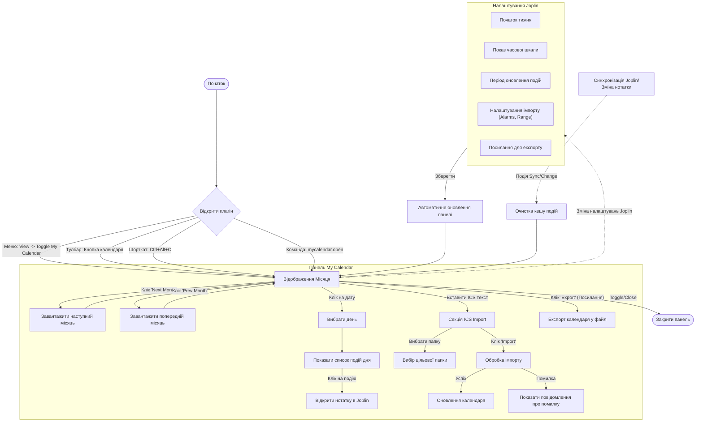
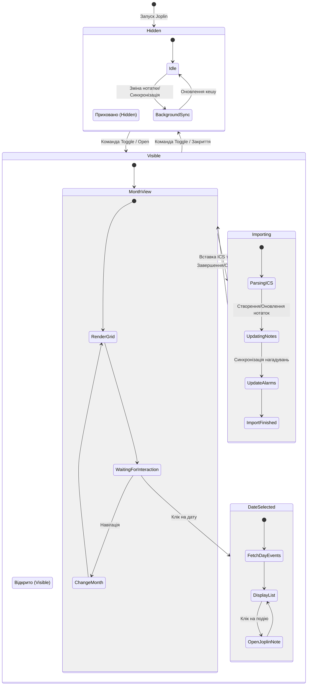

# Діаграми архітектури та поведінки

Цей документ містить діаграми, що описують структуру та поведінку плагіну `joplin-plugin-my-calendar`.

## 1. Поведінкова діаграма користувача (User Flow)

Ця діаграма показує покроковий шлях користувача: від відкриття плагіну до конкретних дій (навігація, перегляд, імпорт).

## 2. Діаграма станів (State Diagram)

Ця діаграма фокусується на життєвому циклі плагіну та його внутрішніх станах.

